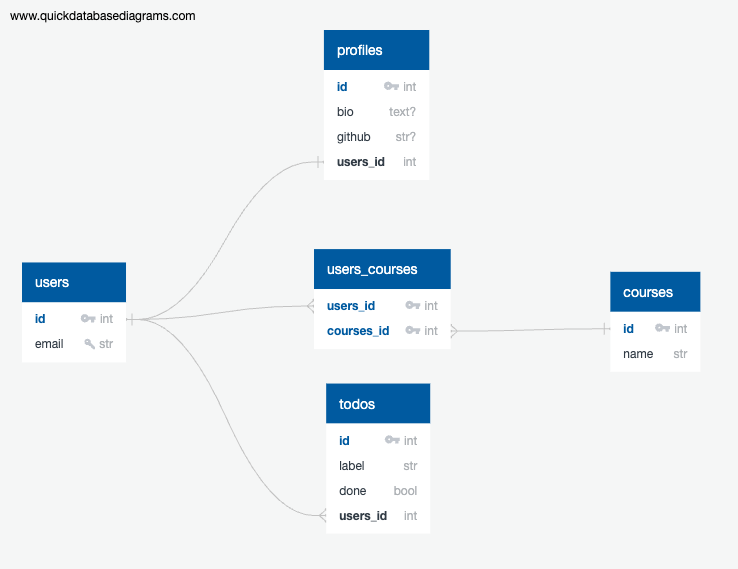

# Modelo Entidad Relacion

# Librerias utilizadas:

- flask
- flask-migrate
- flask-sqlalchemy
- flask-cors
- python-dotenv

# Trabajar con PostgreSQL

- psycopg2-binary

# Trabajar con MySQL

- pymysql